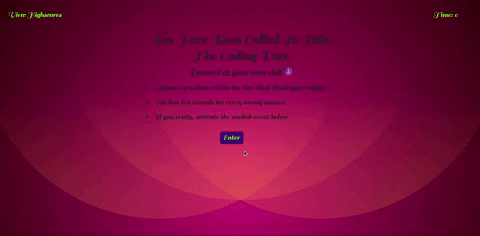

# Web-API-Code-Quiz

A timed coding quiz with multiple-choice questions. This app runs on HTML5 browsers, and features dynamically updated HTML and CSS powered by JavaScript.

## Installation

1. Install any web browser with HTML5 capabilities.
2. Right click on the [index.html](./index.html) and open in installed web browser.

## API Code Quiz

The API code quiz accomplishes the following:

- Start button kickstarts the quiz
- Timer starts and a question appears
- Questions move on to the next after an option is chosen
- Incorrect questions carry a loss of ten seconds to overall time
- The wuiz ends when the timer reaches 0
- Can use initials/name to save score

## Mock-up

The following animarion demostrates the functionality:
 

## Credits

1. Trilogy Education Services, a 2u, Inc. brand.
2. Sound effects downloaded from zapsplat.com
3. Background image downloaded from svgbackground.com
4. Google Fonts

## Badges

## Tests

To test application, run it on any HTML5 supported browser, click 'enter' button and run the quiz as demonstrated in the mock up above.
[LiveLink](https://ifeasome.github.io/Game-Quiz/)

## License

© 2020 Somelina Obiechina
